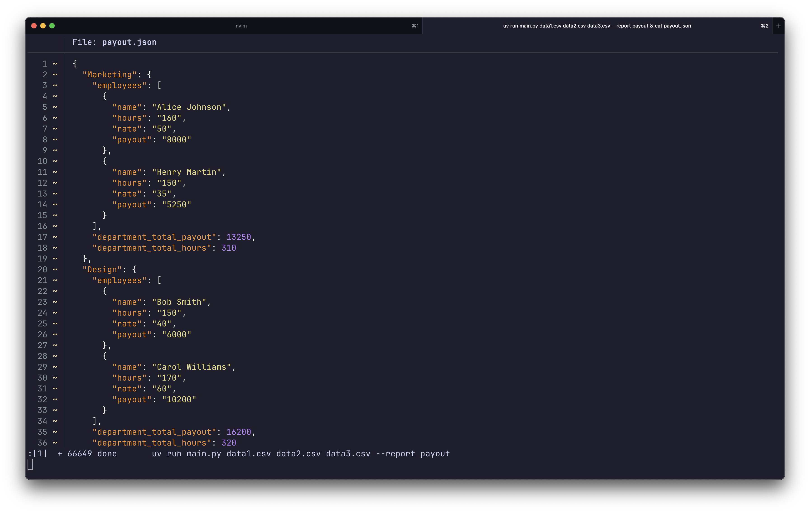
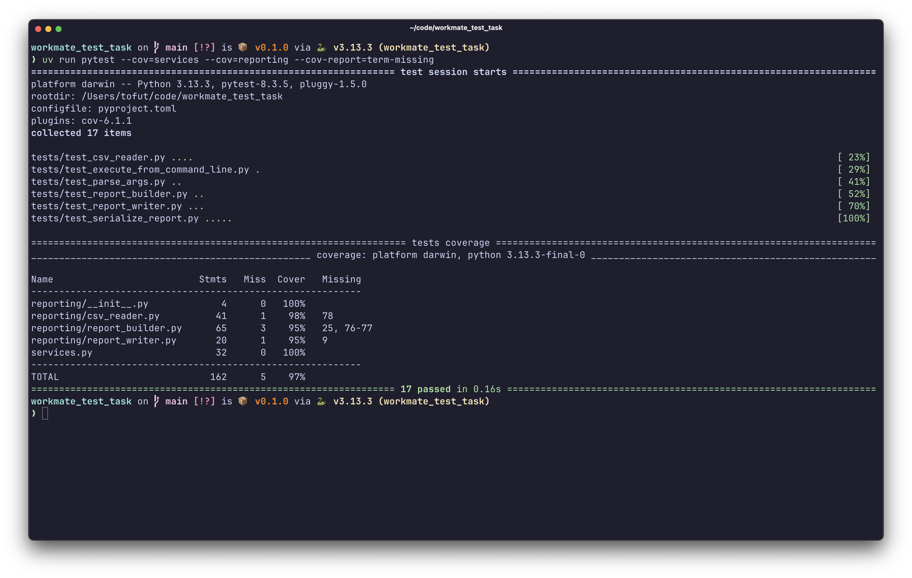

# Workmate Reporting Tool

Инструмент для чтения CSV-файлов с данными сотрудников и генерации отчётов (например, по выплатам), сгруппированных по отделам.

## 📦 Возможности

- Обработка **нескольких CSV-файлов** за один запуск
- Группировка данных по отделам
- Вывод в формате JSON, с возможностью легко добавить иной способ
- CLI-интерфейс

## 🚀 Использование

> [!IMPORTANT]
> Перед запуском убедитесь, что входные CSV-файлы находятся в директории res/
### Запуск используя uv
```bash
git clone https://github.com/tofutych/workmate-test-task.git
cd workmate-test-task
uv run main.py data1.csv data2.csv data3.csv --report payout
```

### Запуск без использования uv
```bash
git clone https://github.com/tofutych/workmate-test-task.git
cd workmate-test-task
python -m venv .venv
source .venv/bin/activate  # или .venv\Scripts\activate на Windows
pip install -r requirements.txt
python main.py res/data1.csv res/data2.csv res/data3.csv --report payout
```

## 📸 Скриншот

### Содержимое файла payout.json после выполнения программы


### Результаты тестов


## TODO

- [ ] Упростить написание type hints